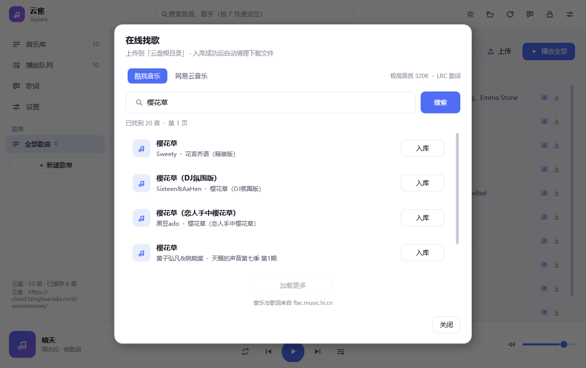

# 云雀 (Skylark)

[](https://github.com/G336ncx-bjx/skylark-music/actions/workflows/ci.yml)
[](https://github.com/G336ncx-bjx/skylark-music/releases)

一个轻量、顺手的**云端音乐播放器**：歌和歌词放在你自己的云盘里，程序只负责取回来播放。

| 平台 | 程序 | 体积 | 亮点 |
| --- | --- | --- | --- |
| Windows 10 / 11 | `Skylark.exe` | 约 340 KB | 单文件、零依赖，双击就能听；带可锁定的桌面歌词 |
| Android 5.0 及以上 | `Skylark-android.apk` | 约 190 KB | 装完即用；通知栏 / 锁屏 / 耳机按键都能控制 |


## 下载

到 [Releases](https://github.com/G336ncx-bjx/skylark-music/releases) 下载：

- `Skylark.exe`：Windows 单文件绿色版，双击即可运行；
- `Skylark-android.apk`：安卓安装包，手机上点开安装；
- `Skylark-win-x64.zip`：exe + 说明的压缩包。

两个平台都没买代码签名证书，首次运行会提示「未知发布者 / 未知来源」——这是未签名程序的正常提示：
Windows 点「**更多信息 → 仍要运行**」，Android 选「**仍要安装**」即可。不放心可以对照 Release 里的
`SHA256SUMS.txt` 校验，或者自己编（见 [开发说明](docs/development.md)）。

## 第一次使用

1. 打开后会直接跳到「设置」，把**云盘分享链接**或**资料库 API 令牌**粘进去（清华云盘 / Seafile 都行）；
2. 回到「音乐库」，点歌名就开始播放并加入播放队列。

云盘里的文件按 `歌名 - 歌手.mp3` 命名，歌词放同名的 `.lrc`：

```
云盘/music/
├─ 默认歌单/
│  ├─ 冬眠 - 司南.mp3
│  └─ 冬眠 - 司南.lrc
└─ 想单曲循环的/
   └─ City of Stars - Ryan Gosling、Emma Stone.mp3
```

- **云盘上的一个文件夹就是一个歌单**（上面例子里的「默认歌单」「想单曲循环的」），
  上传时会放进当前正在看的歌单；
- 一位或多位歌手都行，用 `、` `,` `&` `/` 分隔；
- 歌词支持 UTF-8 / UTF-16 / GBK 编码，支持 `[offset:±毫秒]`、一行多时间戳；
- **外语歌的双语歌词**：译文紧跟在原文后面即可（同一时间戳、或译文带下一句的时间戳都认），
  桌面歌词会显示「原文 + 译文」。

### 两种连接方式

| 方式 | 能做什么 | 怎么拿 |
| --- | --- | --- |
| 分享链接 | 列目录、播放、上传 | 网页版里对文件夹「分享」得到的链接 |
| 资料库 API 令牌 | 上面全部 + **删除云端文件** | 网页版 → 资料库 → 设置 → API 令牌（读写） |

填一个就能用；两个都填时优先用令牌。**令牌等同密码**，只保存在你自己的机器上。

### 在线找歌并入库



电脑版在音乐库点 **「在线找歌」**；安卓版进入歌单后点 **「找歌」**。选择酷我或网易云，输入歌名、歌手，
在搜索结果里确认歌曲版本后点 **「下载并入库」**，即可从 [无损音乐下载网站](https://flac.music.hi.cn/)
获取 **极高音质 MP3 320 kbps** 和 **LRC 歌词**，自动命名为 `歌名 - 歌手.mp3` / `歌名 - 歌手.lrc`，
上传到打开功能时选中的歌单。没有选歌单时，优先使用「默认歌单」，否则上传到云盘根目录。

- 网站有浏览器验证：电脑版会打开独立的 **Microsoft Edge** 窗口（需要已安装 Edge），验证通过后重新搜索；
  安卓版点「网站验证」，完成验证后返回搜索。浏览器会话只用于音乐网站，不会读取日常浏览器账号或向网站发送云盘令牌。
- 「极高音质」是网站的 **320K MP3** 选项。没有这个选项的结果不能入库；没有有效的同步歌词也会停止，
  可以换歌曲版本或搜索平台。
- 下载后检查音频和歌词，上传后核对云端两份文件的文件名、大小，全部确认后删除本次下载的本地文件并刷新音乐库。
- 遇到同名云端文件会停止，避免覆盖。上传失败保留文件及已上传记录，选择同一平台、同一首歌、同一歌单可重试，
  已确认上传的部分会跳过。若服务器已保存文件但上传响应中断，可能需要先检查云端同名文件再重试。
- 自动清理歌名附带的影视主题曲、插曲、片头曲、片尾曲等宣传说明，例如
  `樱花草-《米可，GO！》电视剧主题曲_《星苹果乐园》电视剧插曲` 会命名为 `樱花草 - Sweety.mp3`，
  歌词同名。保留 Live、伴奏、Remix 等版本标识。
- 文件名里的 Windows 非法字符会替换为下划线，超长歌名或歌手分别截到 50 个字符。电脑版失败文件在
  `%APPDATA%\Skylark\music-import`，安卓版在应用私有文件目录；这些文件不会混入播放缓存。

## 功能

**电脑版**

- **音乐库**：搜索 + 歌单筛选，点歌名即播放并加入队列；右键可「下一首播放 / 下载 / 加入歌单 / 从云盘删除」；
  把歌曲或歌词文件拖进窗口就直接上传（传到当前歌单）。
- **在线找歌**：搜索外部歌曲，自动下载极高音质与歌词、按规则命名并上传；确认入库后清理下载文件。
- **播放**：播放 / 暂停、上一首 / 下一首、进度拖动、音量、四种播放模式（顺序 / 列表循环 / 单曲循环 / 随机）。
- **播放队列**：可增删、上移下移、设为下一首、清空；右键菜单里能导入导出 M3U。
- **批量编辑**：点顶部的「批量编辑」，每行左边出现复选框，点一行勾一首（不用按 Ctrl / Shift），
  再点「下载 / 加入歌单 / 删除」对整片选中批量操作；每行右边也有单首的下载按钮
  （可选只下音频 / 只下歌词 / 两者都下）。
- **歌单**：侧栏点一下只看这个歌单，右键可重命名 / 删除，也能新建；
  歌单就是云盘文件夹，换个歌单听歌不用改设置。侧栏的「全部歌曲」是所有歌单的汇总（重复的只显示一次）。
- **歌词页**：逐行高亮、自动滚动、点哪句跳哪句、按歌曲记忆偏移；字号可调
  （设置 → 桌面歌词 → 歌词页字号）。
- **桌面歌词**：置顶浮窗，可拖动、调字号 / 颜色 / 不透明度，**支持锁定**——锁定后鼠标穿透，
  完全不影响你操作电脑。
- 主题跟随系统（也可固定深色 / 浅色）、托盘图标、全局多媒体键、记忆窗口位置与播放进度。

**安卓版**

- **音乐库**：第一层是歌单（文件夹）列表，点进去才是歌曲列表：搜索、播放全部、排序、上传、刷新都在里面。
- **找歌**：在当前歌单搜索外部歌曲，一键下载极高音质和歌词并入库。
- **队列**：点哪首播哪首；队列与播放进度下次打开还在。
- **多选管理**：**长按**列表里的歌进入多选，可以批量**下载（音频 / 歌词 / 两者）/ 加入歌单 / 删除**；
  多选时是原地替换顶部那两行，不会挤掉下面的列表。下载的文件统一放在系统「下载/云雀」目录，
  拷到别的设备也能听。
- **歌单**：长按歌单可以改名 / 删除，列表最后的「＋ 新建歌单」可以直接建；返回键回到歌单这一层。
- **歌词**：逐行高亮 + 自动居中、点句跳转、±0.5 秒偏移（按歌曲记忆）。
- 通知栏 / 锁屏卡片、耳机按键都能控制；在别的 App 里「分享」音频给云雀可直接上传。
- **应用内更新**：设置页最下面的「关于」里点「检查更新」，发现新版本后可直接下载并安装，播放列表和设置保留。

### 本地占用（两端一致）

| 开关 | 行为 |
| --- | --- |
| **关**（默认） | 只在本机留**两首**：正在听的那一首 + 下一首。切歌几乎不用等，更早的自动删掉 |
| **开** | 听过的歌都留在本机，可离线播放；随时可以「清理缓存」 |

> 为什么不能完全不落地：播放器必须先把歌取到本机才能解码。云盘返回的类型写着
> `Content-Type: audio/mp3` 又带 `nosniff`（不规范），直接在线播放会一直卡在「正在缓冲」，
> 所以两端都走「取到本机再播」。

### 支持的格式

| 平台 | 直接能放 | 需要 ffmpeg（只有电脑版用得上） |
| --- | --- | --- |
| Windows | mp3 / m4a / aac / wav / wma / **flac** / **aiff** | ogg / opus / ape / wv |
| Android | mp3 / m4a / aac / wav / wma / **flac** / **ogg** / **opus** | — |

电脑版在设置里指定 `ffmpeg.exe` 后，ogg / opus / ape / wv 会自动转成 mp3 播放（只转一次，之后走缓存）。

## 桌面歌词

| 状态 | 外观 | 鼠标 |
| --- | --- | --- |
| **已锁定** | 完全透明，只有带描边的文字 | 整窗鼠标穿透，点击直接落到下面的窗口 |
| 未锁定 · 鼠标不在上面 | 透明 | 不挡操作 |
| 未锁定 · 鼠标移上去 | 出现半透明底与阴影，右上角浮出小工具栏 | 可拖动、可点工具栏 |


- 两行显示规则：当前句 100% 字号，下一句 **74% 字号**，字重、颜色、亮度完全一致——
  两句都看得清，同时一眼能认出「上面那句更大的是正在唱的」。
- 锁定时鼠标移到**右上角（解锁按钮所在位置）附近**才会浮出那个「解锁」小按钮（53×19 的小胶囊，
  移开约 1 秒淡出）；放在歌词别处不会打扰你，锁定后依然能一键解锁。
- 颜色可在桌面歌词上**右键切换**（10 个预设 + 取色器），字号 / 不透明度在设置里调。

## 快捷键（电脑版）

| 按键 | 作用 |
| --- | --- |
| `空格` | 播放 / 暂停 |
| `←` `→` | 快退 / 快进 5 秒 |
| `Ctrl + ←` / `Ctrl + →` | 上一首 / 下一首 |
| `↑` `↓` | 音量加减 |
| `F` | 定位到搜索框 |
| `L` / `Q` / `D` | 歌词页 / 播放队列 / 桌面歌词 |
| `M` | 静音 |
| `Ctrl + Alt + L` | 锁定 / 解锁桌面歌词（全局） |
| `Ctrl + Alt + D` | 显示 / 隐藏桌面歌词（全局） |
| 多媒体键 | 播放 / 暂停、上一首、下一首（全局，可在设置里关闭） |

## 界面

| 歌词页 | 播放队列 | 设置 |
| --- | --- | --- |
|  |  |  |

| 浅色主题 | 桌面歌词（未锁定） |
| --- | --- |
|  |  |

## 许可证

[MIT](LICENSE)

---

构建方式、项目结构、命令行工具（自检 / 截图 / 云盘校验 / 歌词配对检查）、签名与发布流程，
都放在 [docs/development.md](docs/development.md)。

版本约定：只有用户能感知的功能改动才打 `v*` 标签发版；内部重构和工具改动只推 `main`（CI 依旧会构建并跑自检）。
